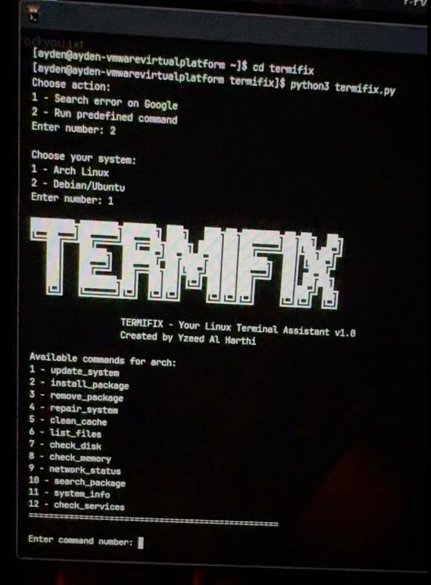

TERMIFIX

TERMIFIX is a Linux terminal tool that works on Arch Linux and other distributions. It helps you quickly search errors online or run predefined commands.

Features

Custom ASCII banner in purple
Search error messages on Google
Run predefined commands for Arch Linux & Debian/Ubuntu
Auto-replace <package_name> in commands

Requirements

Python 3.x
colorama library (pip install colorama)
commands.json file with predefined commands

Usage

1.  Put termifix.py and commands.json in the same folder

2.  Run the tool: python termifix.py

3.  Choose an action:
    Enter 1 to search an error on Google

    Enter 2 to run a predefined command

4.  If running commands, select your system:
    Enter 1 for Arch Linux
    Enter 2 for Debian/Ubuntu

5.  Enter the command number and package name if prompted

------------------------------------------------------------------------------------------------------------------

Termifix

اداة طرفيه تعمل على انظمة لينكس و أرتش تساعدك في البحث السريع عن الأخطاء و تشغيل أوامر محددة

المتطلبات
بايثون
مكتبة colorama(pip install colorama)

الاستخدام

1.  ضع termifix.py و commands.json في نفس المجلد
2.  شغّل الأداة:

python3 termifix.py

3. اختر العملية:

• أدخل 1 للبحث عن خطأ على Google
• أدخل 2 لتشغيل أمر محدد مسبقًا

4.  إذا اخترت تشغيل الأوامر، حدد نظامك:

• أدخل 1 لنظام Arch Linux
• أدخل 2 لنظام Debian/Ubuntu

5.  أدخل رقم الأمر المطلوب وتشغيله. إذا طلب اسم حزمة، أدخله عند الطلب
